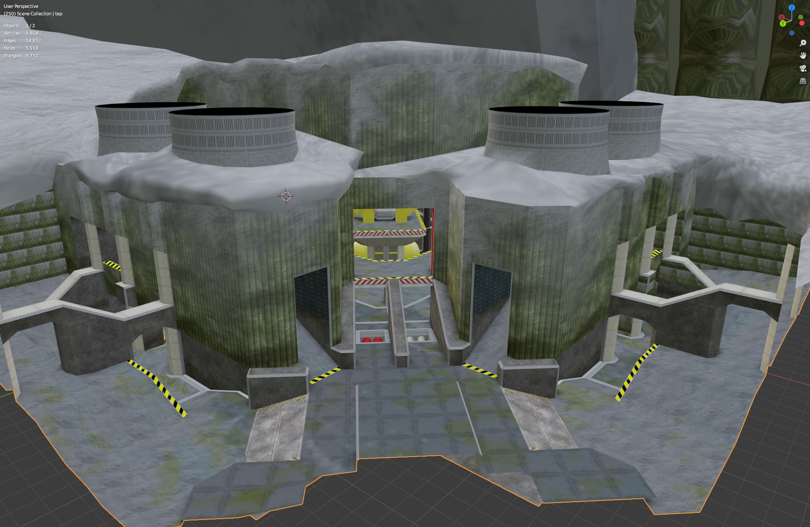

# Venera
Venera is a small competitive-oriented Halo: CE map, based on Monarch by Blaze Lightcap.

# Reference photos
* https://kenyaenergyfuture.files.wordpress.com/2015/10/flash-binary-power-plant-diagram.jpg
* https://englishrussia.com/2014/05/22/russian-geothermal-power-stations/
* https://www.thinkgeoenergy.com/wp-content/uploads/2011/10/Mutnovsky_plant_Kamchatka_Russia.jpg
* https://russiatrek.org/blog/photos/the-first-geothermal-power-plant-in-the-ussr/
* https://www.coolantarctica.com/Bases/OAE/thumbs7.php
* https://www.deviantart.com/atlas-v7x/art/Venus-Map-of-Craters-685020808
